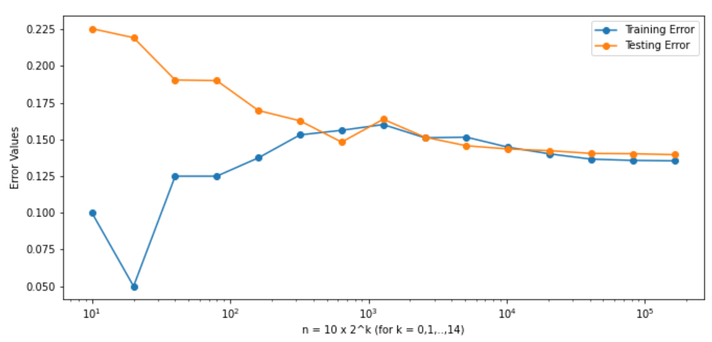

# Sentiment-Analysis-With-Amazon-Reviews

The file 'amazon_reviews_sentiment_analysis.ipynb' is a file done through Google Colab that does the following:
Connect to Amazon Web Servers on Google Colab to read and store data of Amazon reviews, and preprocess the data to create sentiment features in order to fit classification models to predict the star rating of a review based on its text while optimizing running time. We compare various machine learning methods by referring to their runtime and accuracies (1 - the errors).

In the near future, I will attach an html version of the file as indicated at the bottom of the .ipynb file. Feel free to analyse and use the code for personal use. The code has been written by yours truly, much of it has been used from my university project from the course 'Big Data Mining (52002)' (The Hebrew University of Jerusalem).

We connect to AWS and secure a connection to Amazon's reviews dataset with buckets. We then make a pandas dataframe of the name of each category of reviews and their estimated sizes in bytes, gigabytes and gigabytes before compression.


Here we decide to clean and store data from the Digital Video Games category and estimate the total number of data points of each category according to it (the digital video games's dataset). Giving us:
`Number of rows (data points): 145431`
`Number of columns (features): 15`
`Average size of each data point (an Amazon product review): 503.01487980637`
`Estimated total number of reviews: 64366474`

We then process the reviews and add it as a column to the dataset.


We begin with sentiment analysis, using the `sentiment-en-mix-ft-rnn_v8.pt` checkpoints. Let us record how much time it takes to apply sentiment analysis on 100, 1k, and 10k data points.
```
2021-09-18 12:16:59,730 loading file /root/.flair/models/sentiment-en-mix-ft-rnn_v8.pt
: Elapsed time is 0 seconds, or 0.01 minutes
: Elapsed time is 1 seconds, or 0.02 minutes
: Elapsed time is 10 seconds, or 0.17 minutes
```


We decide to use less features 
The total number of features are 15, with them being:
customer_id 	
review_id 	
product_id 	
product_parent 	
product_title 	
star_rating 	
helpful_votes 	
total_votes 	
verified_purchase 	
review_headline 	
review_body 	
reviews_processed 	
sent_score 	
sent_value 	
binstar

We decide to disclude customer_id, review_id, product_id, product_parent, star_rating, review_headline, and review_body since they only added around 0.001 accuracy but lengthened runtime significantly.  

Splitting the data into train and test data sets, and fitting a logistic regression model on the aforementioned data gives:
`Train Accuracy: 0.865`
`Test Accuracy: 0.86`
Taking only the first n-rows of `x_train` and `y_train`, and using that for training the model gives us (test and training error as function of n shown in log-scale):



We do indeed see a general trend that the testing error improves as we increase n, though not necessarily regarding the training error. This is expected since the model fits the general data better by incorporating more values, and the testing and training area begin to converge to the true testing error of the model. When we check the errors of smaller n's, since the model is fitted to a small, and perhaps slightly biased sample, although the training error can be good, the model's relevance deteriorates when compared to the testing error. This is why it has a noticeably relatively large gap between the two errors to begin with, and slowly begins to converge as we include more data points.

We find the maximal power `k` such that the test error for `n=10 * 2^k` is at least `0.02` lower than the test error for the maximal `n` (denoted `n_max` we have used previously, and split the maximal training set you have used into `n_max / n` random blocks of equal size. Next, we run a logistic regression model on each block separately and finally, we average the fitted models coefficients to get a combined model.

We can recognize that the combined train accuracy went down negligibly (in our run, by 0.002), whereas the test accuracy went up—also negligible (by 0.001). So we can be generally confident that overall, the accuracy doesn't change significantly. This does not, by any means, suggest that it is a bad method. This method can allow us to fit models of data we couldn't have been able to otherwise due to various reasons such as with very large data sets in which we lack the processing power to compute due to memory constraints. It wouldn't be possible to fit millions of data points because it would be too demanding on the computer to allocate memory for its operations with the tokenization, sentiment analysis and the model fitting. This way, we can use generators to put aside memory constraints and fit many models through batches which can be averaged out and used to estimate the model of the whole dataset with not any significant accuracy drawbacks.
`Combined Train Accuracy: 0.863` 
`Combined Test Accuracy: 0.861`

Doing this for 9 other categories from the AWS dataset (for each category we read a batch of 100k examples, and do a train-test split of 80-20). As before, we will run a logistic regression model on each category separately and report the train/test accuracies in a table. And finally, we average the fitted models coefficients from all categories to get a combined model.

Both the train + test accuracies of the individual models as well as the combined train + test accuracies seem to have improved compared to those of the previous sections (with the Digital_Video_Games dataset). This is likely because of the reduction in the size of the data sets (from ~140k of the former, and ~10k of the latter). Indeed when I initially ran the algorithm on 10k rows of the D.V.G. set, it also had an accuracy of around 0.89 compared to its 0.863 with the 140k rows. With that aside, we can see that the accuracies of the combined model did not increase nor decrease in any significant manner with any of the individual categories. Any times it did decrease, it was by a factor of 0.2-1% with the train, and 0.1-1.5% with the test. Though we do see that most of the time it would slightly decrease the accuracies rather than slightly increase them. All in all, these results are generally expected since when we do sentiment analysis, it perhaps (or at least shouldn't be) isn't too concerned with the nouns contained in the reviews but rather the adjectives which are universal among the whole language. However, seeing as how we can expect different communities of different products react differently compared to each other, we can then also expect that a slight decrease of the accuracy of the combined model to be the case.


We create an `SGDClassifier` object with the logisitc regression loss. For the same `train_set` fitted previously with the Digital Video Games category, we apply the SGD classifier for 50 epochs (passes over the entire data) using the `partial_fit` method of the object `GSDlogred` we have just created in the previous chunk. Let us plot the loss of the classifier as a function of the number of epochs, and compute the test error of the final output classifier.
* It is very easy to notice that, indeed, the loss does converge relatively fast to what seems like ~0 as the epoch increases. Running it again would display another 50 epochs and that graph seems to resemble more like a stationary time series which does indeed imply convergence.
* The test error as with earlier was approximately 0.14. Seeing as how the final output classifier's test error was 0.15 (on my run), we can see that it did increase, though obviously not by a lot (it is only 1% afterall).
  
`Test Error of final output classifier: 0.152 `
`And its Test Accuracy: 0.848`


We pick one of the six largest categories in the AWS dataset (the PC category) and modify and use the `obj` method, to `stream` (readlines) and loop through the gzip file of this category `100000` bytes at a time, with at least `100` batches (all done inside a with connection to the gzip file). Let us update the model parameters by executing the `GSDlogred.partial_fit` method on each processed batch (we apply all the preprocessing steps to get a processed numpy array, and the splitting to train and test sets before training the model as we did previously).

For each batch, we report the test accuracy for this batch, and also the average test accuracy over all batches so far.

We can observe that there is definitely a noticeable improvement on the accuracy on the test dataset, it was initially in the 0.88-0.89 range, then after 20 batches or so it rose up to 0.91 where it started converging towards 0.905 (or at least this is what I got on my run). The reason why there may be a different number of rows among the batches is because we read by the size of the chunks in bytes. This means that batches with a smaller number of rows will be expected to, on average, have longer reviews compared to those with more rows.


Seeing as how I had personally already previously decided for myself the best features to include in the model that, and at the same time, retain an optimal runtime for the fitting of the model, I will have to find other ways of trying to improve the test accuracy. I had tried various methods of preprocessing the data in order to improve the accuracy such as feature scaling, standardization and normalization of the data sets, but none of them had improved the accuracy. In this way I had decided to look towards other methods, namely, a different classifier (the one I chose was Random Forest), and in addition, hypertuning the parameters of the model using GridSearch. I chose Random Forest because it does not as prone to overfitting, which I was worried was the case with my data, and it can also help balance the relative feature importance. The one disadvantage I have found is that it is very costly in terms of runtime. If I had decided to run the grid search using the random forest classifier on the whole dataset, it wouldn't end up executing or it would take much too long to be of any relative use compared to just using LogisticRegression(). This is why I had decided to take a batch of the x and y train datasets to which I specifically chose according to our graph showing the errors of sizes n which converge. We can notice that after around k=8/9/10, is when the errors begin to converge. This implies that we should aim towards picking a batch of around these sizes (10*2^k for k=8,9, or 10). I ended up deciding for k=10 (which gives us a block size of 1024 rows) since it is not too time costly as it ended up only approximately a minute and a half to sort out 500 fits. And indeed, we had resulted in an improvement albeit not too significant. On my runs, I had a 0.86 test accuracy with the logistic regression model, and a 0.866 test accuracy here with the grid search and random forest classifier, so that's a 0.6% improvement on test accuracy. Nothing too significant, but perhaps worthwhile since the runtime was likewise nothing too significant either.
Fitting 5 folds for each of 100 candidates, totalling 500 fits:
```
[Parallel(n_jobs=-1)]: Using backend LokyBackend with 2 concurrent workers.
[Parallel(n_jobs=-1)]: Done 132 tasks      | elapsed:   11.3s
[Parallel(n_jobs=-1)]: Done 282 tasks      | elapsed:   59.6s
[Parallel(n_jobs=-1)]: Done 500 out of 500 | elapsed:  1.4min finished
: Elapsed time is 86 seconds, or 1.44 minutes
```
`Test Accuracy of best model: 0.866`


